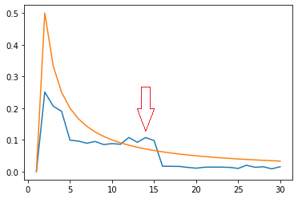
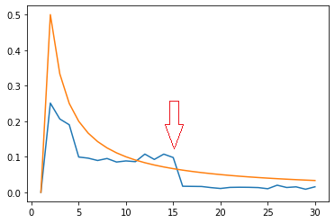
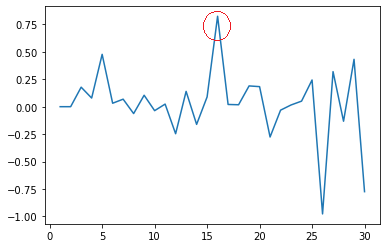
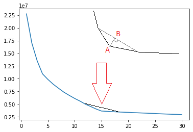
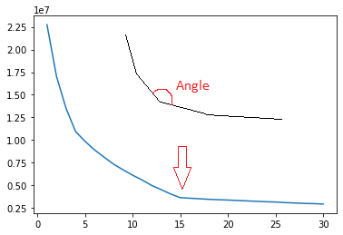

# kmeans_kfinder
KMeans k finder: finds the best k (number of clusters) on supplied dataset.
Works upon sci-kit learn KMeans implementation.
Uses five different methods to find best k; final result is based on voting.

## Metods:
### method #1
k at max difference between delta_kmeans_distance_pct and diff_delta_distance_complexity,
where delta_kmeans_distance_pct represents KMeans distances decrease (derivative from kmeans distance)
and diff_delta_distance_complexity represents inverted complexity increase (basically 1/k).
 
           
### method #2
k, which is previous to last significant drop of delta_kmeans_distance_pct,
where delta_kmeans_distance_pct represents KMeans distances decrease (derivative from kmeans distance)
and only top bigger 25% of drops are taken into account.
 
           
### method #3
k at max delta_of_delta_kmeans_distance_pct,
where delta_of_delta_kmeans_distance_pct is derivative from of delta_kmeans_distance_pct,
which means that delta_of_delta_kmeans_distance_pct is a second order derivative from kmeans distance.
 
           
### method #4
k at max triangle height,
where tringle consists of three nearest points of kmeans distance plot.
 
           
### method #5
k at minimal angle on kmeans distance plot. True elbow method.
 
           
           
